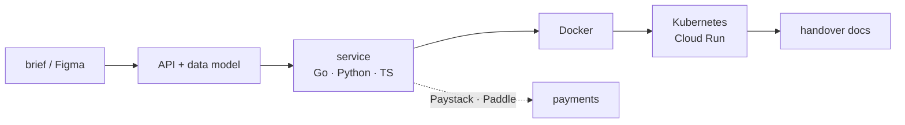

  <picture>
    <source media="(prefers-color-scheme: dark)" srcset="assets/header-dark.svg">
    <source media="(prefers-color-scheme: light)" srcset="assets/header-light.svg">
    
  </picture>

  
  
  
  

---

I build the parts of a product that agencies usually need three people for: the API, the
data model, the infrastructure it runs on, and the docs the client actually reads. Backend
and AI-heavy, comfortable enough in Figma and on a sales call to take a brief straight
through to a running deploy.

A lot of that work is **payments and commerce integration** — Stripe, Paystack, Paddle,
Shopify, and whichever PSP the client is already locked into. Webhooks, reconciliation and
the retry paths that only show up in production.

## ● Services running

Status is real, checked by hand — not a badge that turns green on its own.

| Service | Status | What it is | Stack | Scale |
|---|---|---|---|---|
| **[WaveStack](https://github.com/Enochthedev/WaveStack)** · [↗ live](https://lars-sandy.vercel.app) | 🟢 `live` | AI content pipeline — the biggest system here | FastAPI · LangChain · Anthropic · Docker | 53 commits · 15 test suites · 33 Dockerfiles |
| **[gitsink-api](https://github.com/Enochthedev/gitsink-api)** | ⚪ `source` | Git-backed sync API. My strongest engineering | NestJS · GraphQL · Postgres | 149 commits · 98 test files · 5 CI workflows |
| **[giga-super-app](https://github.com/Enochthedev/giga-super-app)** | ⚪ `source` | **Client work.** Multi-vertical backend: hotels, taxi, shop | Express · BullMQ · Supabase · Stripe | 237 commits · queue-driven |
| **[peeksy](https://github.com/Enochthedev/peeksy)** | ⚪ `source` | Most recent product, a full monorepo | Hono · Next.js · Drizzle | 160 commits |
| **[remote-dev-kit](https://github.com/Enochthedev/remote-dev-kit)** | ⚪ `source` | Remote dev CLI, with a [VS Code companion](https://github.com/Enochthedev/remote-dev-kit-vscode) and a Homebrew tap | TypeScript · CLI | ships via `brew` |
| **[is-my-startup-Trash](https://github.com/Enochthedev/is-my-startup-Trash)** · [↗ live](https://is-my-startup-trash.vercel.app) | 🟡 `degraded` | Roasts your startup idea before an investor does | FastAPI · OpenAI | frontend up, old backend host retired |

🟢 deployed and serving · 🟡 partially up, known cause · ⚪ source only, runs locally

## ⇄ Request path

What a client brief actually goes through. I own every box, which is the whole pitch:

## ⚙ Stack

| | |
|---|---|
| **Core** | Go · Python |
| **Also use** | TypeScript |
| **Frameworks** | FastAPI · NestJS |
| **Infra** | Docker · Kubernetes · Cloud Run |
| **Payments & commerce** | Stripe · Paystack · Paddle · Shopify · PSP integrations generally |
| **Also comfortable with** | Figma/UI design · client documentation · pre-sales |

  <picture>
    <source media="(prefers-color-scheme: dark)" srcset="https://skillicons.dev/icons?i=go,py,ts,fastapi,nestjs,docker,kubernetes,gcp&theme=dark">
    
  </picture>

## ▸ Open the hood

<b>WaveStack</b> — what's actually in it

 

An AI content pipeline built as real services rather than one app: FastAPI at the edge,
LangChain and Anthropic doing the generation, queues between the slow parts, and a Go
analytics service alongside. Containerised throughout, with Kubernetes manifests under
`infra/k8s/base` kept as kustomize bases.

**Worth looking at:** the service split, and the fact it has tests — 15 suites, which is
more than most side projects can say.

<b>gitsink-api</b> — the one to read if you're technical

 

NestJS and GraphQL over Postgres. 98 test files against 149 commits and five CI workflows,
which is the ratio I'd want from someone I was hiring. If you want to judge how I write
backend code under review conditions, read this one rather than the flashier products.

<b>giga-super-app</b> — queues, payments, many verticals

 

Client work. A multi-vertical backend — hotels, taxi, shop — sharing one auth and payment core.
BullMQ carries anything that shouldn't happen inside a request, Supabase holds the data,
Stripe takes the money. 237 commits, and the place most of my queue and webhook scars
came from.

## ⇄ Interfaces

**Open to:** agency subcontracts · backend and AI builds · payment and commerce integrations · systems someone else started and needs finished

| | |
|---|---|
| Email | [wavedidwhat@gmail.com](mailto:wavedidwhat@gmail.com) |
| LinkedIn | [tolu-the-engineer](https://www.linkedin.com/in/tolu-the-engineer/) |
| Writing | [medium.com/@whatisupwave](https://medium.com/@whatisupwave) |
| Elsewhere | [X](https://x.com/whatisupwave) · [YouTube](https://www.youtube.com/@whatsupwave) · [Discord](https://discord.gg/V79u4V3cwG) |

<code>uptime: since 2021 · 153 repos · WAT, overlapping UK/EU hours</code>
